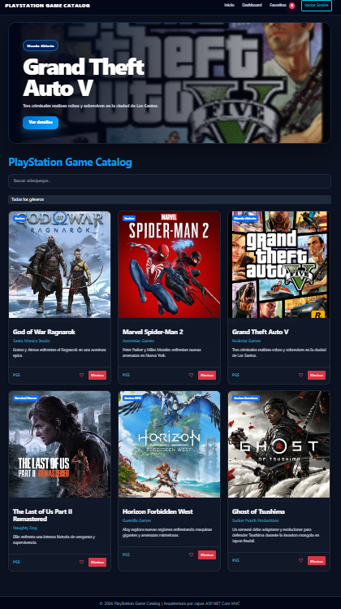
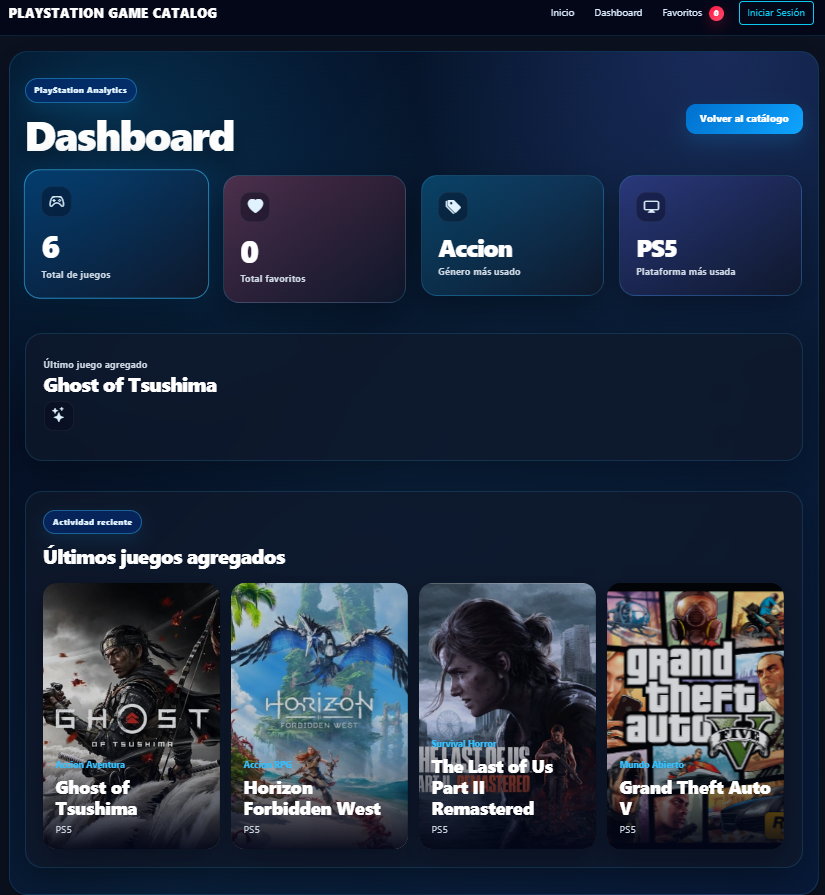
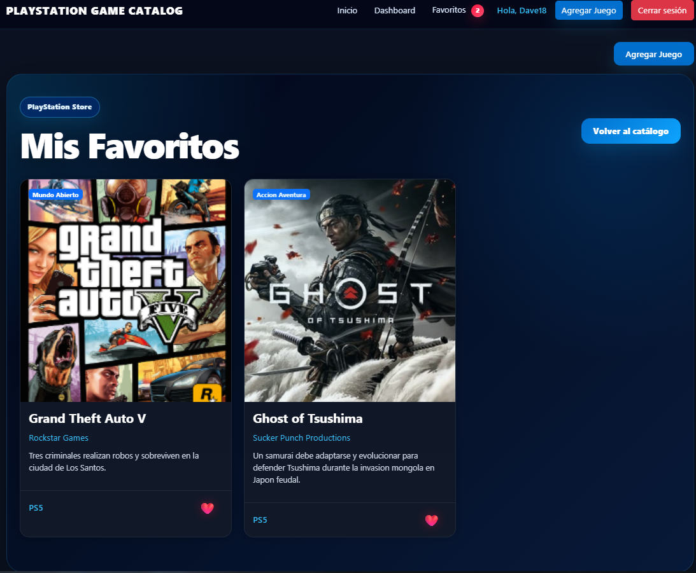
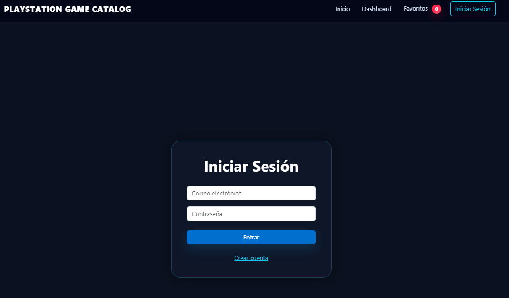
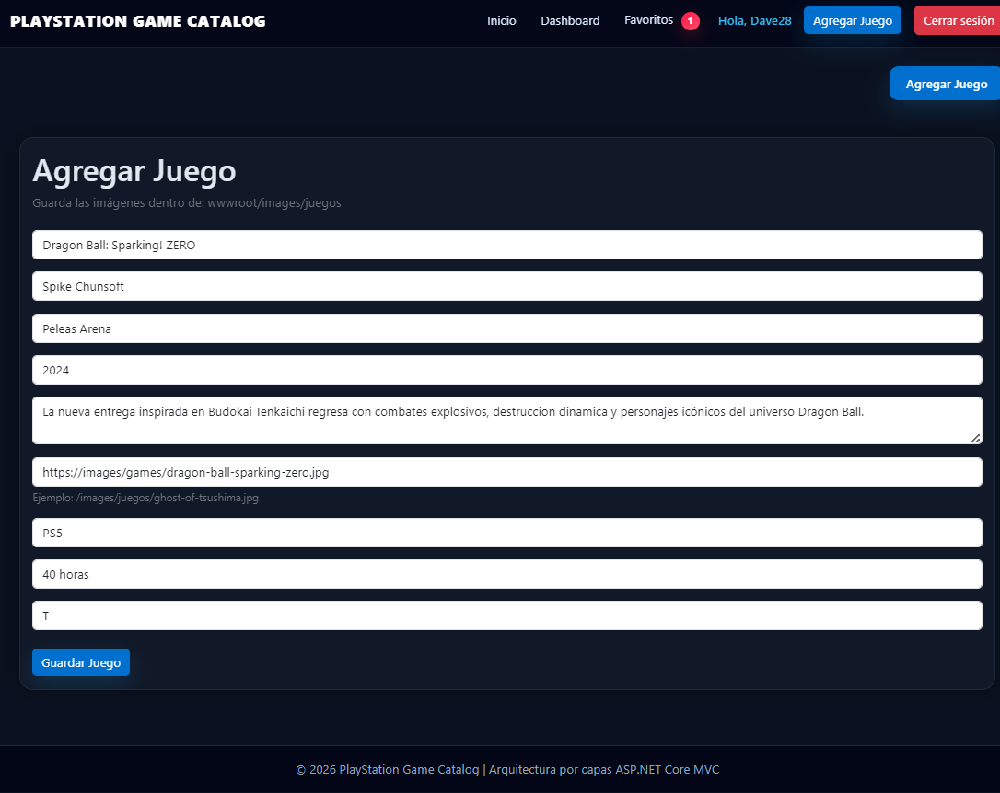
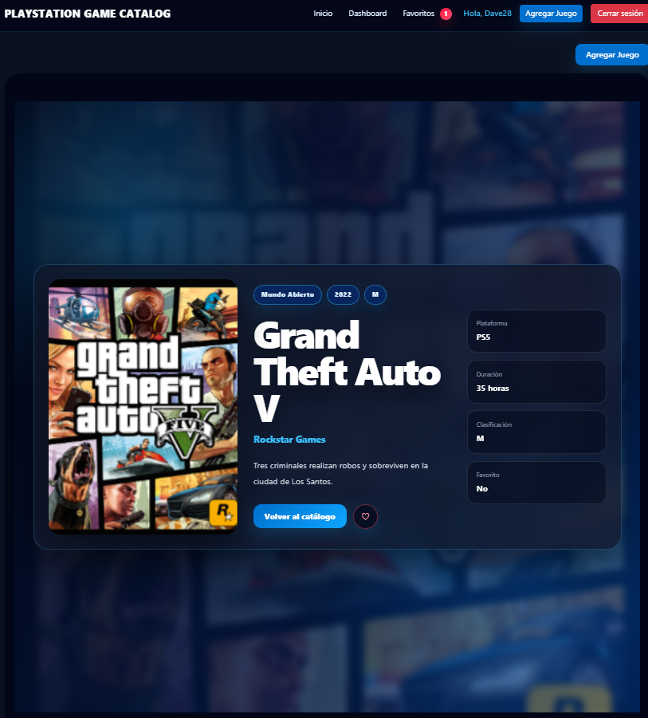
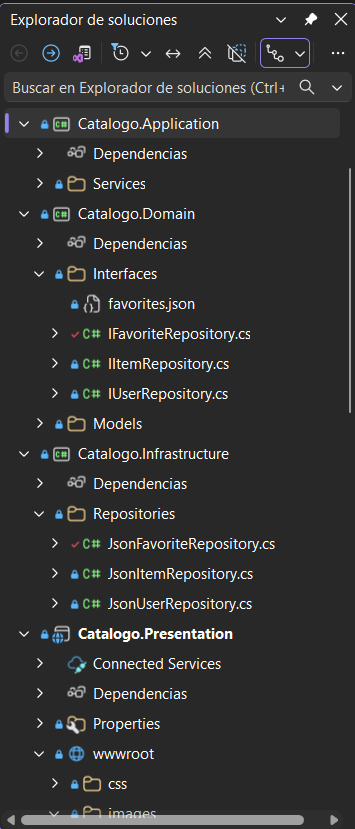

# PlayStation Game Catalog

Aplicación web desarrollada con ASP.NET Core MVC inspirada en la experiencia visual moderna de PlayStation Store.

---

## Descripción General

Este proyecto consiste en una aplicación web enfocada en la administración de un catálogo de videojuegos de PlayStation utilizando ASP.NET Core MVC y arquitectura en capas.

La aplicación permite visualizar videojuegos, agregar nuevos títulos, administrar favoritos, manejar sesiones de usuario y mostrar estadísticas mediante un dashboard interactivo, todo utilizando persistencia local con archivos JSON.

Además de la parte técnica, también se buscó crear una interfaz moderna, visualmente atractiva y cómoda para el usuario, tomando inspiración en el estilo visual actual de PlayStation 5.

---

## Funcionalidades Implementadas

- Arquitectura en 4 capas
- ASP.NET Core MVC
- Sistema de autenticación
- Inicio y cierre de sesión
- Persistencia con archivos JSON
- Dashboard interactivo
- Sistema de favoritos
- Persistencia de favoritos por usuario
- Hero Banner dinámico
- Búsqueda de videojuegos
- Filtro por géneros
- CRUD de videojuegos
- Vista detalle personalizada
- Diseño responsive
- Interfaz inspirada en PlayStation
- Cards dinámicas y modernas
- Animaciones y microinteracciones

---

## Tecnologías Utilizadas

| Tecnología | Uso |
|---|---|
| ASP.NET Core MVC | Arquitectura principal |
| C# | Backend |
| Razor Views | Front-End dinámico |
| CSS3 | Diseño visual |
| JavaScript | Interactividad |
| JSON | Persistencia local |

---

## Arquitectura del Proyecto

El sistema se encuentra dividido en cuatro capas principales:

```bash
CatalogoApp/
│
├── Catalogo.Domain
├── Catalogo.Application
├── Catalogo.Infrastructure
└── Catalogo.Presentation
```

### Domain
Contiene los modelos, entidades e interfaces principales del sistema.

### Application
Contiene la lógica de negocio y los servicios de autenticación, videojuegos y favoritos.

### Infrastructure
Contiene la persistencia de datos mediante archivos JSON y los repositorios.

### Presentation
Contiene los controladores MVC, vistas Razor, estilos CSS, JavaScript y recursos visuales.

---

## Persistencia de Datos

La aplicación utiliza archivos JSON para almacenar la información del sistema:

```bash
Data/
│
├── items.json
├── users.json
└── favorites.json
```

Esto permite:
- guardar videojuegos
- almacenar usuarios
- mantener favoritos por sesión
- evitar depender de una base de datos externa

---

## Principios SOLID Aplicados

### SRP — Single Responsibility Principle

Cada servicio y repositorio tiene una única responsabilidad dentro del sistema.

### DIP — Dependency Inversion Principle

La aplicación utiliza interfaces para desacoplar servicios y repositorios.

Ejemplos:
- IItemRepository
- IUserRepository
- IFavoriteRepository

---

# Interfaz del Proyecto

## Inicio



---

## Dashboard



---

## Favoritos



---

## Login



---

## Agregar Juego



---

## Vista Detalle



---

## Arquitectura en Capas

La solución utiliza separación de responsabilidades mediante arquitectura en capas para mejorar el mantenimiento y organización del sistema.



---

## Experiencia Visual

La interfaz fue diseñada tomando inspiración en el estilo moderno de PlayStation 5, buscando una experiencia visual más limpia y atractiva para el usuario.

El proyecto incluye:
- Hero Banner dinámico
- Diseño oscuro moderno
- Tarjetas animadas
- Hover effects
- Dashboard visual
- Diseño responsive
- Navegación intuitiva
- Microanimaciones

---

## Instalación

### Clonar repositorio

```bash
git clone <repositorio>
```

### Restaurar paquetes

```bash
dotnet restore
```

### Ejecutar proyecto

```bash
dotnet run
```

---

## Uso de Inteligencia Artificial

Durante el desarrollo se utilizó inteligencia artificial como herramienta de apoyo para:

- resolución puntual de errores
- organización visual
- optimización de interfaz
- mejora estructural del proyecto
- apoyo en arquitectura MVC

Todo el desarrollo, adaptación, integración y pruebas finales fueron realizados manualmente dentro del proyecto.

---

## Desarrollado por

David Morales.

Tecnológico del Software  
Materia: Arquitectura de Software

---